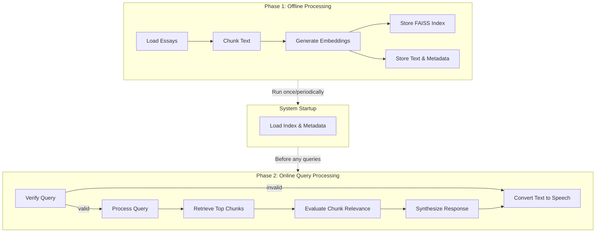

# AI Paul Graham
> Please DON'T remove notes for AI

## Requirements
> Notes for AI: Keep it simple and clear.

The AI Paul Graham system will create an experience where users can ask questions and receive answers in the style of Paul Graham, backed by his actual writings. The system has two main phases:

1. **Offline Processing**: Create embeddings of Paul Graham's essays (chunked into smaller segments) and build the vector search index.

2. **Online Query Processing**: When a user asks a question:
   - Retrieve the most relevant essay chunks
   - Evaluate their relevance and extract insights
   - Synthesize a response in Paul Graham's voice
   - Convert the text response to speech

## Utility Functions
> Notes for AI:
> 1. Understand the utility functions thoroughly by reviewing the doc.
> 2. Only include the most important functions to start.

1. **Call LLM** (`utils/call_llm.py`)

2. **Text Chunking** (`utils/text_chunker.py`)
   - Splits text into overlapping chunks with configurable size and overlap, favoring natural break points.

3. **Embedding Generation** (`utils/embedding.py`)
   - Generates vector representations of text using OpenAI's text-embedding-ada-002 model.

4. **Vector Search** (`utils/vector_search.py`)
   - Implements FAISS index for fast similarity search
   - Core Functions:
     - `create_index()`: Creates a FAISS IndexFlatIP for cosine similarity 
     - `search_index()`: Returns indices and scores of most similar vectors
     - `save_index()` & `load_index()`: Persists indices to disk

5. **Data Loading** (`utils/data_loader.py`)
   - Loads essay text files and associated metadata from specified directories.

6. **Text-to-Speech** (`utils/text_to_speech.py`)
   - Converts text responses to audio using Google Cloud Text-to-Speech API
   - Uses MD5 hash of input text as filename for efficient caching
   - Core Function:
     - `synthesize_text_to_speech()`: Converts text to speech and returns hash identifier

## Flow Architecture
> Notes for AI:
> 1. Consider the design patterns of agent, map-reduce, rag, and workflow. Apply them if they fit.
> 2. Present a concise and high-level description of the workflow.

The system will use a RAG (Retrieval Augmented Generation) pattern with additional evaluation steps for quality control. The system operates in two phases, with resource loading occurring at system startup:

### 1. Offline Processing
1. **LoadEssaysNode**: Load essays and metadata
2. **ChunkTextNode**: Chunk essays into smaller segments
3. **GenerateEmbeddingsNode**: Create embeddings for each chunk
4. **StoreIndexNode**: Create FAISS index and store to disk
5. **StoreMetadataNode**: Store chunk text and metadata to disk

### 2. Online Query Processing
1. **VerifyQueryNode**: Validate if the query is relevant to startups or if it's spam
2. **ProcessQueryNode**: Take user query and convert to embedding
3. **RetrieveChunksNode**: Find top 5 most similar chunks using FAISS
4. **EvaluateChunksNode**: Evaluate relevance of each chunk 
5. **SynthesizeResponseNode**: Create final response in Paul Graham's style
6. **TextToSpeechNode**: Convert the text response to speech audio

Note: At system startup, the FAISS index and chunk metadata are loaded from disk before processing any queries.

### Flow Diagram
> Notes for AI: Carefully decide whether to use Batch/Async Node/Flow.



## Data Structure

The system operates with two main data structures:

### Phase 1: Offline Processing Data
```python
offline_data = {
    # Configuration
    "data_dir": "path/to/data",  # Directory containing essay files
    "meta_csv": "path/to/meta.csv",  # CSV file with essay metadata
    
    # Processed data
    "essays": {essay_id: text_content, ...},  # Dictionary of essay ID to full text
    "metadata": pandas_dataframe,  # DataFrame of essay metadata
    "chunks": [
        {"id": "essay_id_chunk_n", "text": "chunk text", "essay_id": "essay_id", "position": n}
    ],  # List of text chunks from essays
    
    # Generated data
    "embeddings": numpy_array,  # The embedding vectors (only needed during offline processing)
    
    # Output artifacts
    "chunk_metadata": [
        {
            "id": "essay_id_chunk_n", 
            "essay_id": "essay_id", 
            "title": "essay title", 
            "date": "date",
            "text": "The actual chunk text"  # Text content preserved with metadata
        }
    ],  # Metadata and text content to be stored
    
    # Output paths
    "faiss_index_path": "path/to/save/index.faiss",  # Where to save the FAISS index
    "metadata_path": "path/to/save/metadata.json"  # Where to save the chunk text and metadata
}
```

### Phase 2: Online Query Processing Data
```python
system_data = {
    # System resources (loaded at startup)
    "faiss_index": faiss_index_object,  # The FAISS vector index for similarity search
    "chunk_metadata": [
        {
            "id": "essay_id_chunk_n", 
            "essay_id": "essay_id", 
            "title": "essay title", 
            "date": "date",
            "text": "The actual chunk text"  # Text content needed for retrieval
        }
    ],  # Contains the text and metadata of each chunk
    
    # Query-specific data (reset for each query)
    "query": "user question text",  # The user's question
    "is_valid_query": True/False,  # Whether the query is valid (startup-related) or spam
    "rejection_reason": "explanation of why query was rejected",  # Only present for invalid queries
    "query_embedding": vector,  # Vector representation of the query
    
    # Processing results
    "retrieved_chunks": [
        {
            "text": "chunk text",
            "metadata": {chunk metadata},
            "score": similarity_score,
        }
    ],  # Raw chunks from vector search
    
    "relevant_chunks": [
        {
            "text": "chunk text",
            "metadata": {chunk metadata},
            "score": similarity_score,
            "is_relevant": True/False,
            "relevance_explanation": "explanation"
        }
    ],  # Chunks after relevance evaluation
    
    "final_response": "synthesized response",  # The final text response
    "audio_file_hash": "md5_hash_of_response",  # Hash identifier for TTS audio file
}
```

## Node Specifications

### Phase 1: Offline Processing Nodes

#### 1. LoadEssaysNode
- **Purpose**: Load essays and metadata from files
- **Design**: Regular Node
- **Data Access**:
  - Read: "data_dir", "meta_csv" 
  - Write: "essays", "metadata"

#### 2. ChunkTextNode
- **Purpose**: Split essays into manageable chunks with overlap
- **Design**: BatchNode (processes each essay)
- **Data Access**:
  - Read: "essays", "metadata"
  - Write: "chunks"

#### 3. GenerateEmbeddingsNode
- **Purpose**: Create embeddings for each text chunk
- **Design**: BatchNode (processes each chunk)
- **Data Access**:
  - Read: "chunks"
  - Write: "embeddings", "chunk_metadata" (adds text content to metadata)

#### 4. StoreIndexNode
- **Purpose**: Create and save FAISS index to disk
- **Design**: Regular Node
- **Data Access**:
  - Read: "embeddings"
  - Write: Creates "faiss_index_path" file on disk

#### 5. StoreMetadataNode
- **Purpose**: Save text chunks and metadata to disk
- **Design**: Regular Node
- **Data Access**:
  - Read: "chunk_metadata"
  - Write: Creates "metadata_path" file on disk

### Phase 2: Online Query Processing Nodes

#### 6. VerifyQueryNode
- **Purpose**: Validate if the query is relevant to startups or if it's spam
- **Design**: Regular Node
- **Execution**:
  - Calls an LLM with a prompt that asks if the query is related to startups, entrepreneurship, programming, or other topics Paul Graham writes about
  - The LLM returns a structured output indicating if the query is valid and why
  - If the query is deemed irrelevant, spam, or inappropriate, it:
    - Sets is_valid_query = False
    - Sets final_response to something like "This is not a question I want to answer. Humm. I only advise on startup. Humm."
    - Skips retrieval and synthesis steps
- **Data Access**:
  - Read: "query"
  - Write: "is_valid_query", "rejection_reason" (if invalid), "final_response" (if invalid)
- **Actions**:
  - If valid → processQuery
  - If invalid → textToSpeech

#### 7. ProcessQueryNode
- **Purpose**: Process user query and generate embedding
- **Design**: Regular Node
- **Data Access**:
  - Read: "query"
  - Write: "query_embedding"

#### 8. RetrieveChunksNode
- **Purpose**: Find top related chunks to the query
- **Design**: Regular Node
- **Data Access**:
  - Read: "query_embedding", "faiss_index", "chunk_metadata"
  - Write: "retrieved_chunks"

#### 9. EvaluateChunksNode
- **Purpose**: Determine relevance of each chunk to the query
- **Design**: BatchNode (processes each retrieved chunk)
- **Data Access**:
  - Read: "query", "retrieved_chunks"
  - Write: "relevant_chunks"

#### 10. SynthesizeResponseNode
- **Purpose**: Generate final response in Paul Graham's style
- **Design**: Regular Node
- **Data Access**:
  - Read: "query", "relevant_chunks"
  - Write: "final_response"

#### 11. TextToSpeechNode
- **Purpose**: Convert text response to speech audio
- **Design**: Regular Node
- **Data Access**:
  - Read: "final_response"
  - Write: "audio_file_hash"

### System Initialization (Not Node-Based)
The system loads resources at startup through standard code:

```python
def initialize_system(config):
    """Load necessary resources at system startup."""
    # Load FAISS index
    faiss_index = load_index(config["faiss_index_path"])
    
    # Load chunk metadata (includes text content)
    with open(config["metadata_path"], "r") as f:
        chunk_metadata = json.load(f)
        
    return {
        "faiss_index": faiss_index,
        "chunk_metadata": chunk_metadata
    }
```